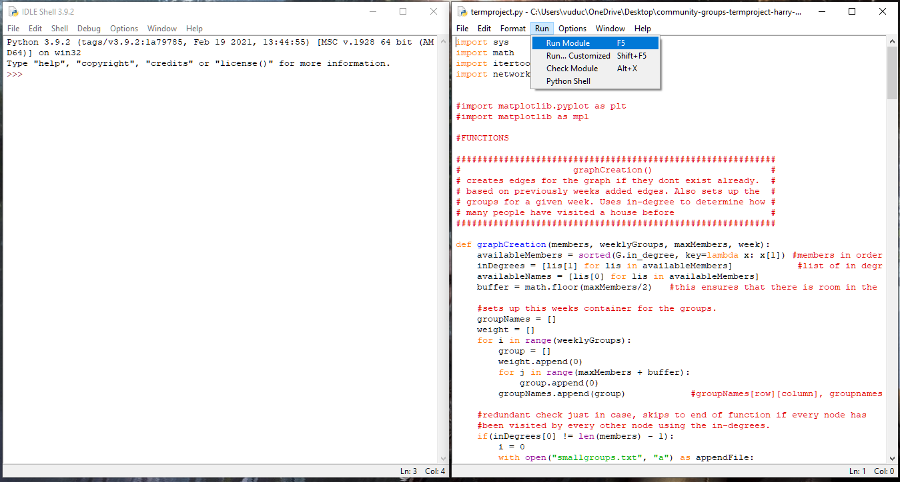
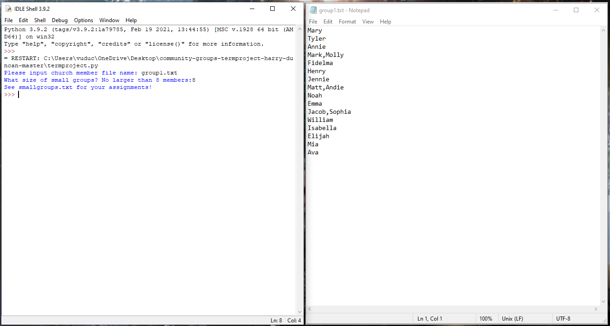

# Creating Community Small Groups
A work by Duncan Hook and Quynh Vu

This application takes a list of names and creates a timetable for a small group Bible study with an alternating host. Names can be entered as a couple, and they will not be separated in the small group. Everyone will get assigned in the group with every other member. 

## Description
This project was written using Python. This program will take in a .txt input file of names and produce the smallgroups.txt timetable file. The first person in the group is the host. 

## Requirements
The program requires Python 3 and above. Users might need to install the extra module(s) if their Python does not have it. The name input must be in the correct format, with each name or couple name on separate lines. Libraries used: os, sys, math, itertools, networkx.

## User Manual
Once users cloned this into their computer, they can use the Python IDLE to run our termproject.py. The program will prompt the user to input the church member file name. The file name can be edited with every name in a separate line (except for couples.) Then the program will ask the user to enter the small group's size (no more than half the size of total members.) Users can view the timetable in the smallgroups.txt file.
Photos:  
 
See result in smallgroups.txt   
Video Link: https://youtu.be/eu-2bcD8pd8
 
## Reflection
This project gave a list of n people with a size of small groups m. To find the minimum number of iterations necessary to accomplish everybody's goal of visiting everybody's house, we need to figure out how many times a person is visiting homes. Provided that they are also the host, one person would visit n - 1 houses. So n people would take n(n - 1) times to visit every home. When visiting done in groups, m people would visit n - m, each group would visit m - 1 house. Total iteration would be n - m + m - 1 => m(n - 1) iterations.  
One visit equals one unit of time, and the total time equals the total number of visits.  
We believe that the algorithm we have implemented is O(n3). This is because the repeated checking, if certain edges exist while checking if a singular edge exists, is a fast process; when you can theoretically check for the edge three times in different functions, it adds up to O(n3).  
We encountered some major hurdles during this project. The first one experienced was just how to set up the problem to catch every combination without fail. This problem probably took the longest to overcome, as it’s the entire base of the project. When I found the networkx package for Python, the path forward became much clearer. With an easy way to create a graph and check nodes, being able to measure who has gone to whose house with the various nodes in-degrees was a lifesaver.  
The next problem occurred when the only missing connections involving the various current group’s hosts needed to visit each other’s houses.This was because the algorithm is set up; the group leaders get set up first before any connection checking is done. This took a little while to figure out. We solved this by developing a function to compare the hosts to one another if they had gone through the group forming process without making any connections. (This is because our algorithm initially only adds new connections to the groups, so if groups are empty, then the hosts need to connect to one another).  
Finally, the last major problem encountered was that groups would stop being populated with already made connections. Many group members were left out of groups the further the program went on. We solved this similarly to the hosts needing to visit each other. Make a function that assigns leftover people to groups until every individual is accounted for and in a group.
